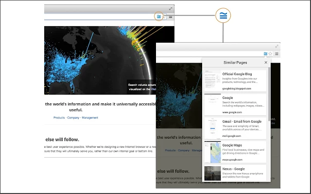

# Google-Similar-Pages

##Chrome Extension - Google Similar Pages - Reverse Engineered For Education Purposes

###offered by google.com

Discover web pages similar to the page you're currently browsing.
Discover webpages similar to the page you're currently browsing.
Enjoying the page you're looking at and interested in other similar pages?  Trying to find more pages about a topic you're researching, but having a hard time coming up with the right query on Google?  Google Similar Pages can help!

Now you can quickly preview and explore other pages that are similar to the one you are browsing -- on the fly.

When you click the Similar Pages button, your browser will send a search query to Google to see if there are any similar pages for the page you are viewing.  The data related to the query will be handled as described in Google's privacy policy (http://www.google.com/privacypolicy.html).

Please be aware that this extension is still an early beta release so many aspects of the extension may change in the coming months.  Help us make it better by sending bug reports to similarpages-extension@google.com (include the Chrome version number and OS you are using).

By installing this extension, you agree to the Terms of Service at https://chrome.google.com/extensions/intl/en/gallery_tos.html

